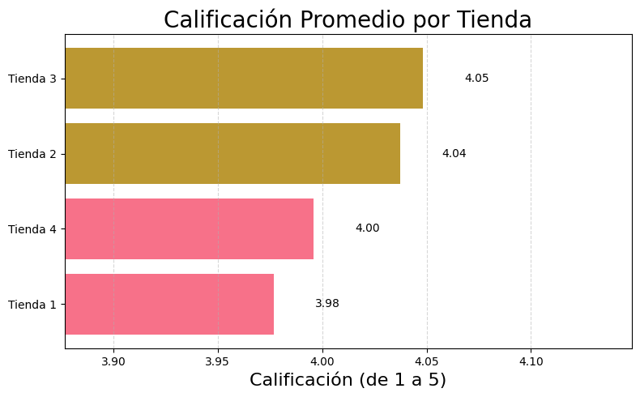

# ChallengeAluraStore

1.El propósito del analisis realizado
Durante este desafío, he ayudado al Sr. Juan a decidir qué tienda de su cadena Alura Store debe vender para iniciar un nuevo emprendimiento.

2.La estructura del proyecto y organización de los archivos
Para ello, analicé datos de ventas, rendimiento y reseñas de las 4 tiendas de Alura Store. El objetivo gue identificar la tienda menos eficiente y presentar una recomendación final basada en los datos.
Para eso debí evaluar información como los ingresos, las categorías más vendidas, las reseñas de los clientes, los productos más vendidos y el envío promedio.

 3.Ejemplos de gráficos e insights obtenidos
Para presentar los resultados de forma clara y visual, he obtenido los siguientes gráficos diferentes:

4.Instrucciones para ejecutar el notebook
Descagar el archivo AluraStoreLatam.ipynb y ejecutarlo en Google Colab.
 

